# Lab Report: UX/UI
___
**Course:** CIS 411, Spring 2024  
**Instructor(s):** [Devi Bhakta Suberi](https://github.com/dsuberi)  
**Name:** Kara Wiegel  
**GitHub Handle:** Kara-Wiegel  
**Repository:** cis411_lab3_uiux
**Collaborators:** Madeline & Colleen  
___

# Step 1: Confirm Lab Setup
- [✓] I have forked the repository and created my lab report
- [✓] If I'm collaborating on this project, I have included their handles on the report and confirm that my report is informed, but not copied from my collaborators.

# Step 2: Evaluate Online Job Search Sites

## 2.1 Summary
| Site | Score | Summary |
|---|---|---|
| Handshake | 16/21 | Handshake has a beautiful interface with easy to find information. It is easy to use and find jobs. |
| Indeed | 17/21 | Indeed has a decent interface with an issue being reading about the jobs. It is okay to use and find jobs |

## 2.2 Handshake
Insert Recorded Screenshots with captions and steps.

| Category | Grade (0-3) | Comments / Justification |
|---|---|---|
| 1. **Don't make me think:** How intuitive was this site? | 3  | 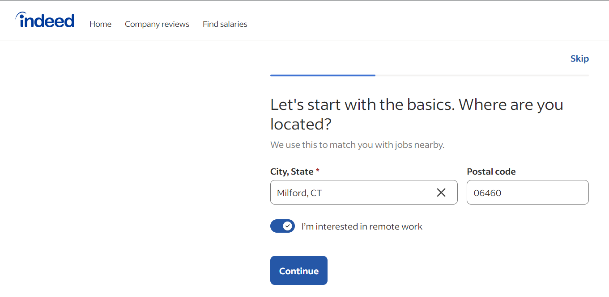 The site was very inuitive, it was easy to use and find everything pretty easily. There weren't many buttons you could click on.  |
| 2. **Users are busy:** Did this site value your time?  | 3  | 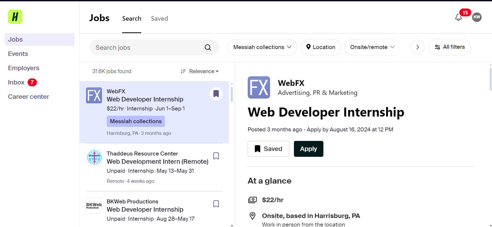 There are lots of radio buttons to easily filter what jobs you are searching for. There is another buttons to view all filters, but the quick ones make it easy to find jobs.  |
| 3. **Good billboard design:** Did this site make the important steps and information clear? How or how not? | 2 |   | When you first create an account, it forces you to go through the minimum number of steps to get the most important information up for people to start finding you. But it didn't make you put some important stuff in right away which had to be added later. I have already had an account for a while, so this is going off memory.  |
| 4. **Tell me what to do:** Did this site lead you towards a specific, opinionated path? | 3  | 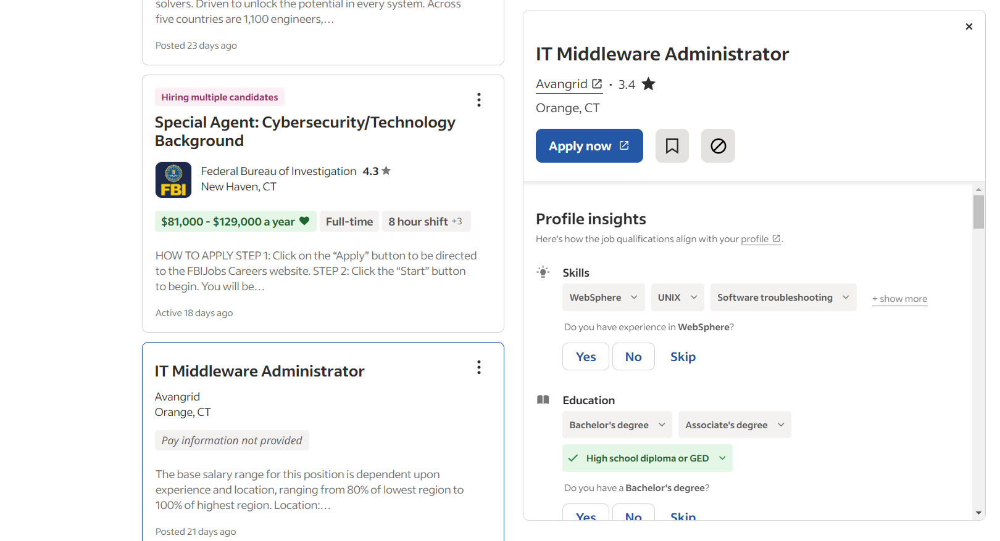 As you start putting information in and search for specific fields, it starts reccomending jobs based on your searches on the home page. |
| 5. **Omit Words:** How careful was this site with its use of copy? | 1  | 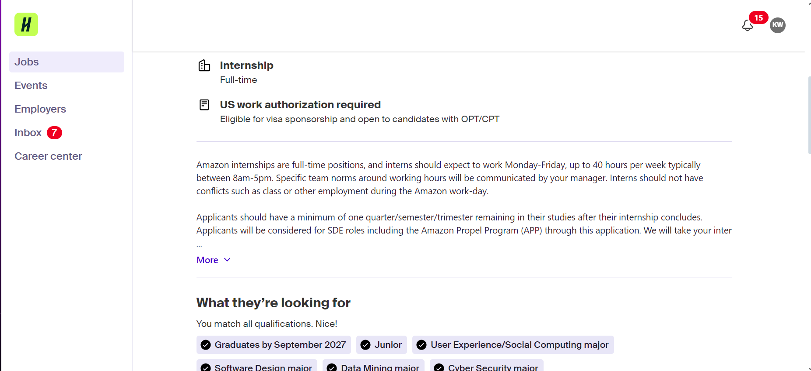 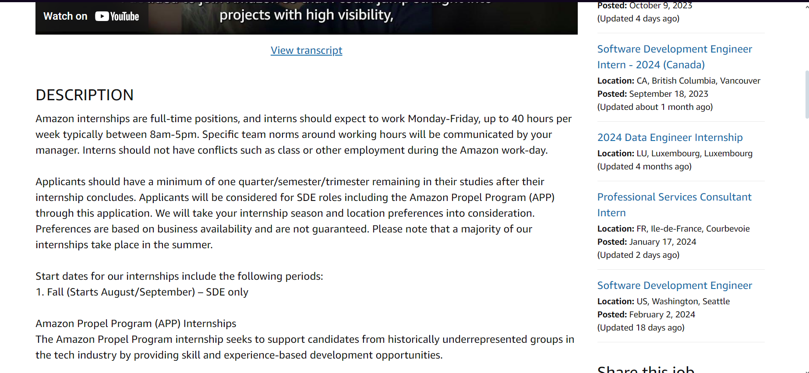While most of the jobs that had an external applying link were word for word with the job externally. They at least including the link to the description.  |
| 6. **Navigation:** How effective was the workflow / navigation of the site? | 3  | 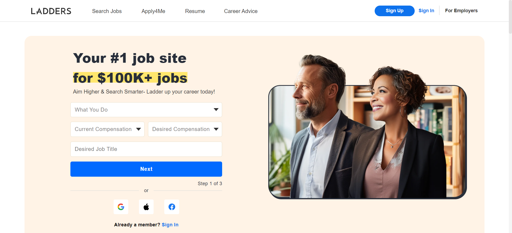 Naivation of the website was super easy with not many links to go to. They were all straight forward and it was super easy to find what you want to get to fast. |
| 7. **Accessibility:** How accessible is this site to a screen reader or a mouse-less interface? | 3  | 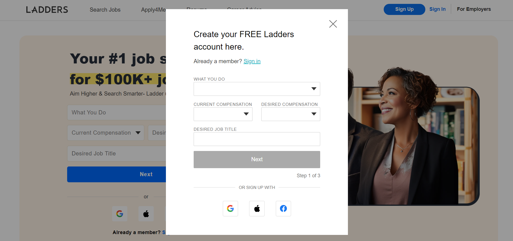 The touch version of the website on the phone was super nice and easy to use, even going as far to have an app (which I already had) for easier use.  |
| **TOTAL** | 16  |   |

## 2.3 Indeed
Insert Recorded Screenshots with captions and steps.

| Category | Grade (0-3) | Comments / Justification |
|---|---|---|
| 1. **Don't make me think:** How intuitive was this site? | 2  | 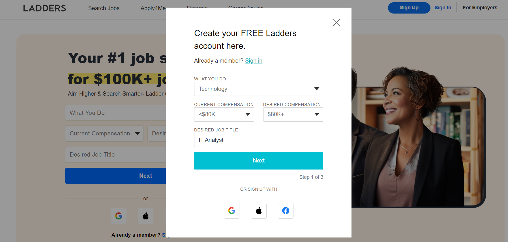 Home page is the job search page as well, however, you have to find the exact working you want for the job with location. There are no filter buttons before searching. |
| 2. **Users are busy:** Did this site value your time?  | 2  | 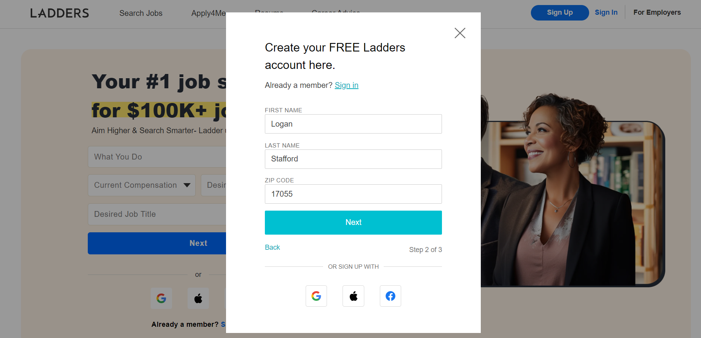 There weren't many buttons and you can find what you are looking for quick. However, the job search bar you have to search one before you can filter. |
| 3. **Good billboard design:** Did this site make the important steps and information clear? How or how not? | 3  | 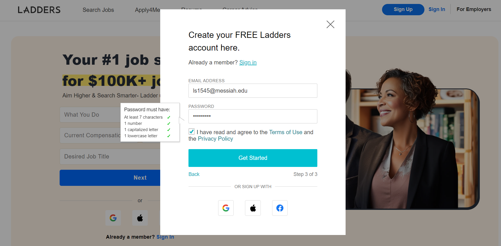 easy to find information you need, whether it be jobs, company reviews or finding salaries for jobs you want. Everything important is found really quick.  |
| 4. **Tell me what to do:** Did this site lead you towards a specific, opinionated path? | 2  | 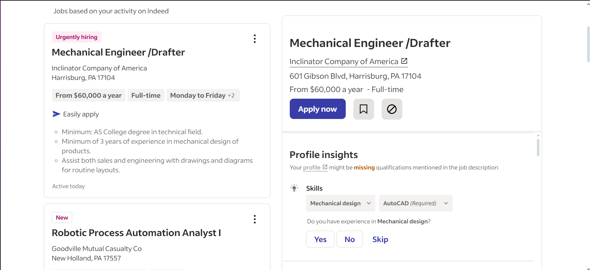 While it gives you jobs based on your activity, it is puts urgent or new jobs first that are kind of the same but not.  |
| 5. **Omit Words:** How careful was this site with its use of copy? | 3  | 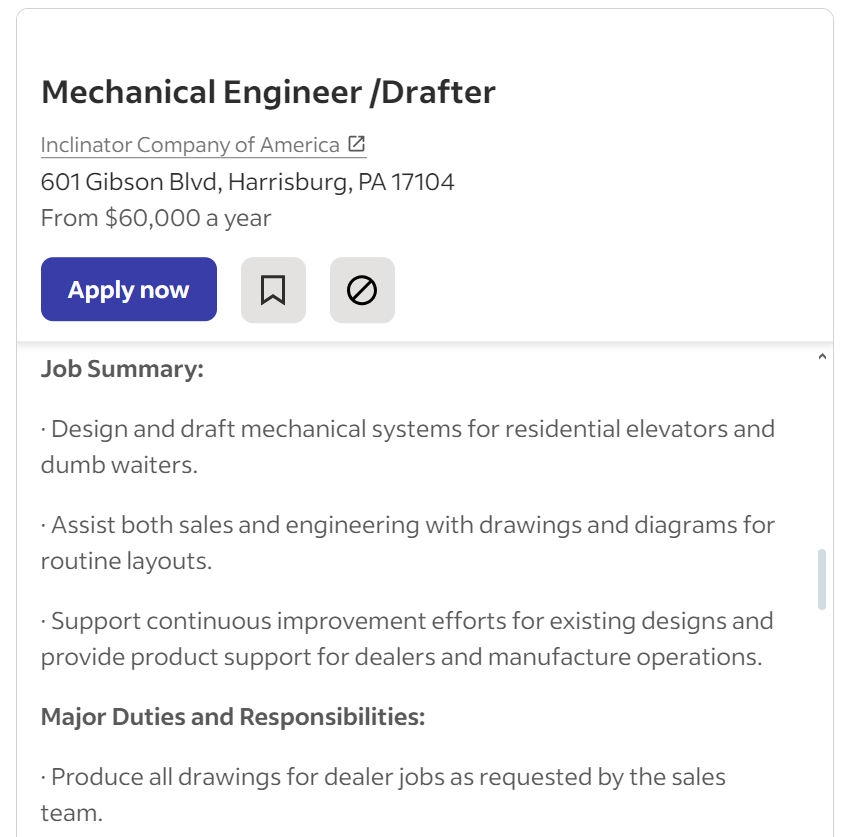 I tried finding this job on the company's website or out somewhere on the internet. But I couldn't find the job listed anywhere else but on Indeed  |
| 6. **Navigation:** How effective was the workflow / navigation of the site? | 2  | 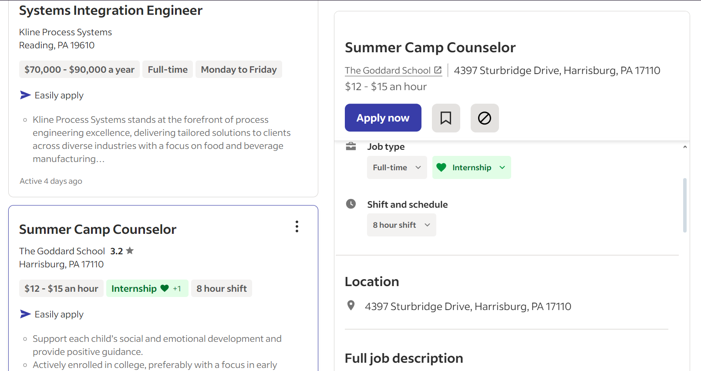 While the buttons and finding things on the website were fairly easy. It was reading the jobs that was hard to navigate as there was no larger page to read it on. Only the samll side bar which if you scrolled wrong would send you scrolling down the jobs not the description. |
| 7. **Accessibility:** How accessible is this site to a screen reader or a mouse-less interface? | 3  | 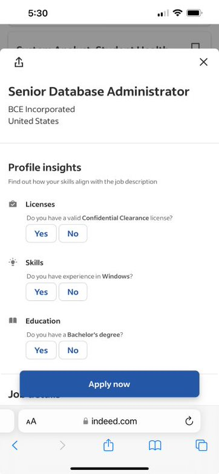 The website on my phone was so much easier to navigate and find things then the website on my computer. I could expand job descriptions and read it so much better.  |
| **TOTAL** | 17  |   |

# Step 3 Competitive Usability Test

## Step 3.1 Product Use Case

| Use Case #1 | |
|---|---|
| Title | Create An Account |
| Description / Steps | Creating a verified student own account and setting up your profile
1. Setting up a username and password, then entering in your email.
2. Getting verified with a verification link sent to your student email.
3. Creating an account with a picture, tags to find people with similiar interest, and filling out information about yourself. |
| Primary Actor | Customer |
| Preconditions | 1. Downloading the app and opening it |
| Postconditions | 2. Account is added to large database and list of most compatible for other students to find. |

## Step 3.2 Identifier a competitive product

List of Competitors
1. [Bumble](https://bumble.com)
2. [ZeeMee](https://www.zeemee.com)

## Step 3.3 Write a Useability Test

| Step | Tasks | Notes |
|---|---|---|
| 1 | Create a Verified Account  |  To test and see if the user can easily create an account |
| 2 | Create a Profile  | Easy to make account with all information users want on their account  |
| 3 | Start swiping for potential friends for yes and no  | To test how easy it is to swipe yes or no on other students.  |
| 4 | Match with another student succesfully  | Is the system easy to use and find other students succesfully?  |
| 5 | Start chatting with the other students  | The chat system is easy to use and messages are quick to deliever back and forward.  |

## Step 3.4 Observe User Interactions

| Step | Tasks | Observations |
|---|---|---|
| 1 | Create a Verified Account  | "Most accounts will email your inbox and verify your messiah email address." "There is a two-factor authentication because no one likes it. She hates switching back and forth between multiple apps" |
| 2 | Create a Profile  | "To enter in email, major, class status, and interests" "Depending on if its compatible anaylsis. What is the algorithm? Is it like Bumble?"  |
| 3 | Start swiping for potential friends for yes and no  | "We should be able to go backward on swiping no one someone without cost. Check yes or no on someone instead of swiping with an additional yes or no." "The two-factor swipe thing could be annoying because it's a double-check, but it could also be necessary. or an archive no-match history."  |
| 4 | Match with another student succesfully  | "Congrats, you matched a student, and they are nice." "The only thing unexpected is the fact you actually match with someone, especially the opposite gender in a friendship setting considering Messiah’s culture."  |
| 5 | Start chatting with the other students  | "Finding out whether or not you click, start a club. Less Bumble-like interface and more IOS Message interface. Video call in the app or send photos." "What would be frustrating would be people abusing the friendship aspect and go for hookup culture. Or people never reply after matching."  |

## Step 3.5 Findings
Organize your findings here.
**Three Improvements**
1. To see if there is a way to verify the user within the app via a pop-up or some other way.
2. Instead of throwing the "No people" into the don't show list, throw them into an archive to go back and look at.
3. Instead of the possible swiping system, an improvement instead could be yes or no buttons with an additonal button of maybe.

**Two Experiences that were benefitual**
1. Having to create an account right away that is verified and other students are verified.
2. The messaging system that has a good interface.

**What do you believe your team did well in conducting the usability test?**
My team (my section) did well in conducting the usability test by explaing the app before showing the steps so the test subject knows why they are taking certain steps on what system. Giving away the idea without explainging what it looks like.

**What could your team improve for next time (hint: there will be a next time)?**
An improvement for the for testing next time would be to have some visual elements or some test system to see how the user really interacts with the system. As my test subject wasn't good with hearing the description and trying to think of something as a visual learner. The steps weren't helpful without some visual of idea.

**A brief statement**
My personal experience with the usability test was not as put together as it could have been. There should be a better way to put this together in perhaps a presentation and classroom setting instead of more personal for a real idea of testing the usability. 