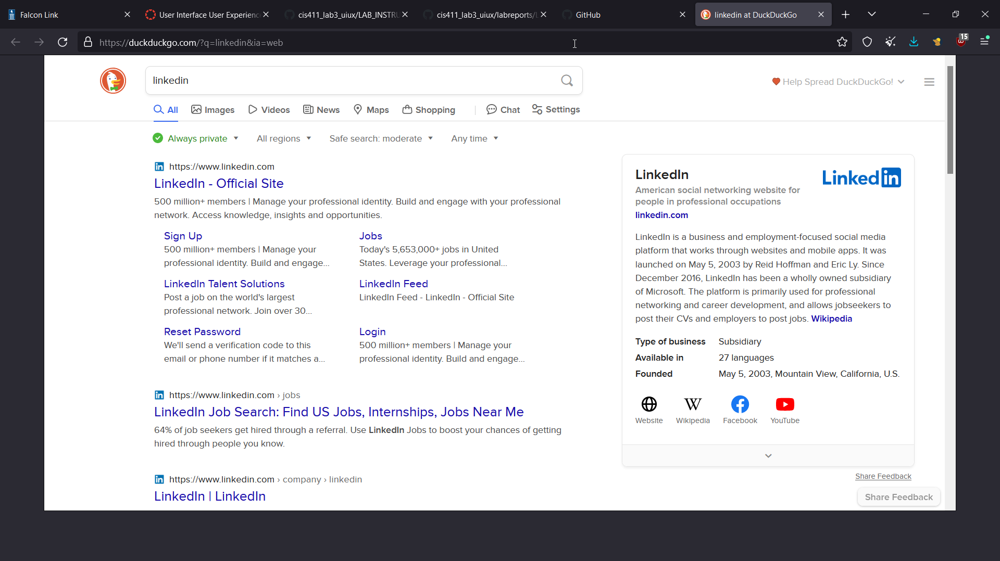

# Lab Report: UX/UI
___
**Course:** CIS 411, Spring 2024  
**Instructor(s):** [Devi Bhakta Suberi](https://github.com/dsuberi)  
**Name:** Phillip Swann 
**GitHub Handle:** 4saken 
**Repository:** Your Forked Repository  
**Collaborators:**   
___

# Step 1: Confirm Lab Setup
- [x] I have forked the repository and created my lab report
- [x] If I'm collaborating on this project, I have included their handles on the report and confirm that my report is informed, but not copied from my collaborators.

# Step 2: Evaluate Online Job Search Sites

## 2.1 Summary
| Site | Score | Summary |
|---|---|---|
| LinkedIn | 9/10 | The site was well organized, condensed while still being readable. I have been on LinkdIn before so I am somewhat familiar with the format but it is a nice touch that for incomplete profiles they give you a "nudge" to complete it in a non-intrusive way |
| Indeed | 8/10  | The login was typical of any site. However for creating a password it was clear that it was desired for them to have you connect your google account as opposed to making a separated account. Inserting job listings were easy on the surface however there was practically nothing for cybersecurity or computer science. Applying for a jo however had a nice touch where clicking apply it opened a new tab. Overall good experience |

## 2.2 Site 1

| Category | Grade (0-3) | Comments / Justification |
|---|---|---|
| 1. **Don't make me think:** How intuitive was this site? |   |   |
| 2. **Users are busy:** Did this site value your time?  |   |   |
| 3. **Good billboard design:** Did this site make the important steps and information clear? How or how not? |   |   |
| 4. **Tell me what to do:** Did this site lead you towards a specific, opinionated path? |   |   |
| 5. **Omit Words:** How careful was this site with its use of copy? |   |   |
| 6. **Navigation:** How effective was the workflow / navigation of the site? |   |   |
| 7. **Accessibility:** How accessible is this site to a screen reader or a mouse-less interface? |   |   |
| **TOTAL** |   |   |

## 2.3 Site 2
Insert Recorded Screenshots with captions and steps.

| Category | Grade (0-3) | Comments / Justification |
|---|---|---|
| 1. **Don't make me think:** How intuitive was this site? |   |   |
| 2. **Users are busy:** Did this site value your time?  |   |   |
| 3. **Good billboard design:** Did this site make the important steps and information clear? How or how not? |   |   |
| 4. **Tell me what to do:** Did this site lead you towards a specific, opinionated path? |   |   |
| 5. **Omit Words:** How careful was this site with its use of copy? |   |   |
| 6. **Navigation:** How effective was the workflow / navigation of the site? |   |   |
| 7. **Accessibility:** How accessible is this site to a screen reader or a mouse-less interface? |   |   |
| **TOTAL** |   |   |

# Step 3 Competitive Usability Test

## Step 3.1 Product Use Case

| Use Case #1 | |
|---|---|
| Title | |
| Description / Steps | |
| Primary Actor | |
| Preconditions | |
| Postconditions | |

## Step 3.2 Identifier a competitive product

List of Competitors
1. Competitor 1 [www.awesomesauce.com](www.awesomesauce.com)
2. Competitor 2 [Bangarang Peter](https://www.youtube.com/watch?v=4PNOccSUb1Q)

## Step 3.3 Write a Useability Test

| Step | Tasks | Notes |
|---|---|---|
| 1 |   |   |
| 2 |   |   |
| 3 |   |   |
| ... |   |   |
| n |   |   |

## Step 3.4 Observe User Interactions

| Step | Tasks | Observations |
|---|---|---|
| 1 |   |   |
| 2 |   |   |
| 3 |   |   |
| ... |   |   |
| n |   |   |

## Step 3.5 Findings
Organize your findings here.