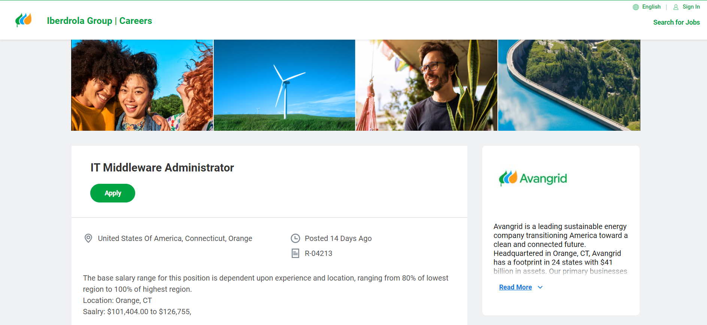

# Lab Report: UX/UI
___
**Course:** CIS 411, Spring 2024  
**Instructor(s):** [Devi Bhakta Suberi](https://github.com/dsuberi)  
**Name:** Alex Georgeff
**GitHub Handle:** alexgeorgeff 
**Repository:** (https://github.com/alexgeorgeff/cis411_lab3_uiux/blob/main/labreports/LAB_alexgeorgeff.md)
**Collaborators:**  none 
___

# Step 1: Confirm Lab Setup
- [x] I have forked the repository and created my lab report
- [x] If I'm collaborating on this project, I have included their handles on the report and confirm that my report is informed, but not copied from my collaborators.

## 2.1 Summary
| Site | Score (Out of 10) | Summary |
|---|---|---|
| [Site 1](https://www.linkedin.com/) | 8/10 | LinkedIn is widely regarded as the premier platform for job searching. It not only assists users in finding significant employment opportunities but also enables them to establish and expand their professional networks. The platform features a sleek design, although the interface can sometimes appear cluttered. Moreover, the social dynamics of the site may contribute to the growing concerns about self-image, exacerbated by the pressure to present an impeccable persona on social media. Nevertheless, the relationships built on LinkedIn frequently aid users in securing their subsequent roles. Overall, the platform is user-friendly and offers concise information about job listings. |
|[ Site 2](https://www.indeed.com/) | 6/10 | Indeed is another well-known job search platform. The most notable distinction between LinkedIn and Indeed is that Indeed does not emphasize networking and connections. Unlike LinkedIn, which also displays pictures, Indeed tends to have a busier appearance due to the high volume of text on each page. Although both platforms aim to serve the same purpose, LinkedIn comes across as more intuitive and user-friendly.  |

## 2.2 Site 1
Insert Recorded Screenshots with captions and steps.

| Category | Grade (0-3) | Comments / Justification |
|---|---|---|
| 1. **Don't make me think:** How intuitive was this site? |3 |   Profile is displayed on side, it only takes one click to access it or most other functions on site as shown here.|
| 2. **Users are busy:** Did this site value your time?  | 3  | Site is clearly laid out, with different functions easy to access as shown by the bars on the side and top.  |
| 3. **Good billboard design:** Did this site make the important steps and information clear? How or how not? | 3  | Information is displayed clearly with high contrast between the text and the backgrounds.  The jobs section is a good example of this.   |
| 4. **Tell me what to do:** Did this site lead you towards a specific, opinionated path? |  3 |  Yes, an application, connections, or posts. However, sometimes these paths lead you off the website.   |
| 5. **Omit Words:** How careful was this site with its use of copy? | 3 | Relatively simple and straight forward.   |
| 6. **Navigation:** How effective was the workflow / navigation of the site? | 2.75 | There are a few clear, distinct places to navigate on the site. However, it would be helpful if they had words in addition to pictures, even when the window is not in full screen.  |
| 7. **Accessibility:** How accessible is this site to a screen reader or a mouse-less interface? |  3 | LinkedIn is very accessible and even provides detailed instructions for configurations like using a screen reader or mouse-less display. |
| **TOTAL** | 21  |   |

## 2.3 Site 2
Insert Recorded Screenshots with captions and steps.

| Category | Grade (0-3) | Comments / Justification |
|---|---|---|
| 1. **Don't make me think:** How intuitive was this site? | 2  | Fewer features than LinkedIn, however jobs are first thing displayed on screen.    |
| 2. **Users are busy:** Did this site value your time?  |  2 | Site does a good job providing information about jobs, however, the site does not allow you to search by skills or see if you have connections at various companies. However, they are very clear about potential salaries.   |
| 3. **Good billboard design:** Did this site make the important steps and information clear? How or how not? | 2.5  | It is clear when you hover over a title that you should click on the link.  Additionally, there is a clear 'apply now' button at the bottom of the page.  The pages are rather long, causing users to lose interest|
| 4. **Tell me what to do:** Did this site lead you towards a specific, opinionated path? |2.5   | Search and other features are well marked. Clear  As noted previously, the 'apply now' button is very clear, however you must scroll all the way to the bottom to find it, which is inconvenient.   |
| 5. **Omit Words:** How careful was this site with its use of copy? | 0  |Site is very wordy. Very few pictures to break up text, which can make users lose interest and focus.    |
| 6. **Navigation:** How effective was the workflow / navigation of the site? |  3 | Very few steps/places to naviagate, but they are clearly laid out and easy to find.   |
| 7. **Accessibility:** How accessible is this site to a screen reader or a mouse-less interface? |3   | Indeed is aware of the need for accessible technology and has in-depth resources to help users configure and utilize tools like screen readers.   |
| **TOTAL** |  15 |   |

# Step 3 Competitive Usability Test

## Step 3.1 Product Use Case

| Use Case #1 | |
|---|---|
| Title | User Shops Online |
| Description / Steps | User browses, selects, and purchases products using an online platform. |
| Primary Actor | User |
| Preconditions | User must be logged in with a valid account. |
| Postconditions | Purchase confirmation email received. |

## Step 3.2 Identify a Competitive Product

List of Competitors
1. Competitor 1 [Amazon](https://www.amazon.com/)
2. Competitor 2 [eBay](https://www.ebay.com/)

## Step 3.3 Write a Usability Test

| Step | Tasks | Notes |
|---|---|---|
| 1 | User logs into the platform | Ensure access is secure and user-friendly. |
| 2 | User searches for an item | Test the efficiency of the search engine. |
| 3 | User reviews product listings | Assess the clarity of information and layout. |
| 4 | User selects a product | Evaluate the ease of navigating product options. |
| 5 | User adds product to cart | Check the intuitiveness of the shopping cart process. |
| 6 | User proceeds to checkout | Confirm that the checkout process is streamlined. |
| 7 | User completes purchase | Ensure transaction security and simplicity. |

## Step 3.4 Observe User Interactions

| Step | Tasks | Observations |
|---|---|---|
| 1 | Log into the platform | User accessed the platform smoothly, without any hiccups. |
| 2 | Search for an item | User efficiently found the desired item using the search function. |
| 3 | Review product listings | Product information was clear and easily understandable. |
| 4 | Select a product | User navigated the options easily and made a selection without confusion. |
| 5 | Add product to cart | The process was intuitive; user added items to the cart effortlessly. |
| 6 | Proceed to checkout | Checkout was seamless and user-friendly. |
| 7 | Complete purchase | Transaction was secure and completed without issues. |

## Step 3.5 Findings
All findings are detailed above.

Image 1 of the interface: 
Image 2 of the checkout page: 

Improvements:
1. Streamline product search functionality.
2. Enhance mobile responsiveness.
3. Provide clearer product descriptions.

Experiences:
1. The platform was intuitive and easy to navigate.
2. Checkout process was quick and user-friendly.

How did the team perform conducting the test?
- The team effectively managed the usability test, gathering valuable insights.

How could the team improve?
- Increase the diversity of test scenarios to cover more user experiences.

Brief statement:
- Overall, the usability test was successful, revealing that the platform is capable of providing a smooth shopping experience. Suggestions for improvement focus on enhancing specific aspects of the user interface and functionality.
