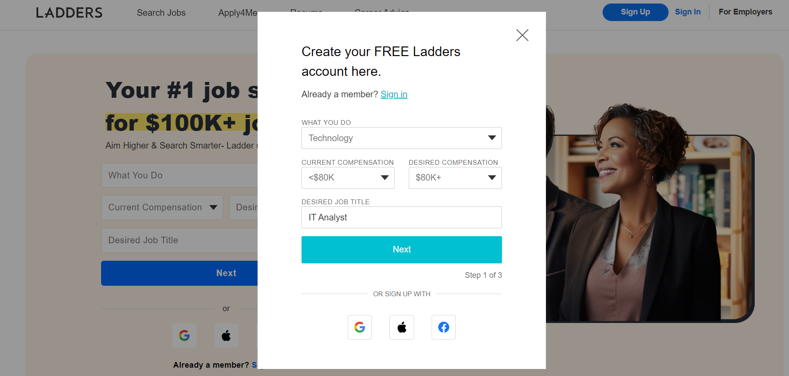
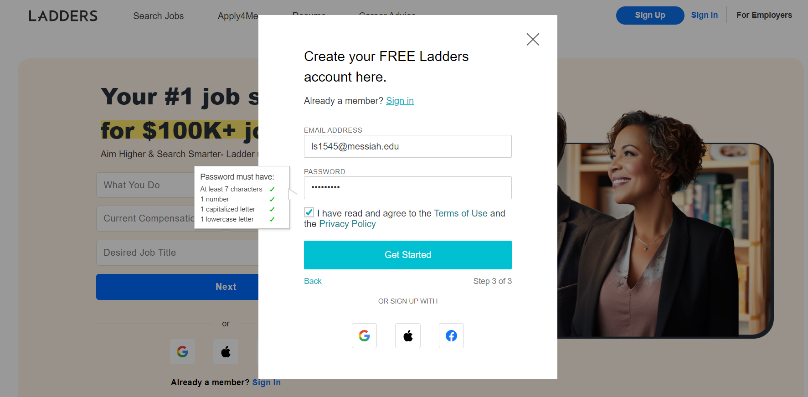

# Lab Report: UX/UI
___
**Course:** CIS 411, Spring 2024  
**Instructor(s):** [Devi Bhakta Suberi](https://github.com/dsuberi)  
**Name:** Carolina Hatch 
**GitHub Handle:** carolinahatch  
**Repository:** (https://github.com/carolinahatch/cis411_lab3_uiux/tree/main/labreports) 
**Collaborators:**   Brandan Snook,  Nathan Steinbach, Jess Donahoue for Step 3
**Note:**  Accounts on both sites existed previously
___

# Step 1: Confirm Lab Setup
- [x] I have forked the repository and created my lab report
- [x] If I'm collaborating on this project, I have included their handles on the report and confirm that my report is informed, but not copied from my collaborators.

# Step 2: Evaluate Online Job Search Sites

## 2.1 Summary
| Site | Score (Out of 10) | Summary |
|---|---|---|
| [Site 1](https://www.linkedin.com/) | 8/10 | LinkedIn is the industry standard for a job searching platform. Not only does it help users find meaningful jobs, it also allows them to connect with one another and build their network. The design is clean, however the screen can often be busy. Additionally, the social aspect of the website can add to the increasing issues of self-image we are seeing with the rise of social media and the need people feel to display themselves as flawless. However, connections formed on LinkedIn often help users find their next position. Overall, LinkedIn is simple to navigate and provides clear information about listed jobs. |
|[ Site 2](https://www.indeed.com/) | 6/10 | Indeed is another popular job searching platform. The biggest difference between LinkedIn and Indeed is Indeed's lack of networking and connections. to While LinkedIn also features pictures, I found Indeed to be busier given the amount of words on each page. While both serve the same purpose, I found LinkedIn to be more intuitive and user-friendly.  |

## 2.2 Site 1
Insert Recorded Screenshots with captions and steps.

| Category | Grade (0-3) | Comments / Justification |
|---|---|---|
| 1. **Don't make me think:** How intuitive was this site? |3 |   Profile is displayed on side, it only takes one click to access it or most other functions on site as shown here.|
| 2. **Users are busy:** Did this site value your time?  | 3  | Site is clearly laid out, with different functions easy to access as shown by the bars on the side and top.  |
| 3. **Good billboard design:** Did this site make the important steps and information clear? How or how not? | 3  | Information is displayed clearly with high contrast between the text and the backgrounds.  The jobs section is a good example of this.   |
| 4. **Tell me what to do:** Did this site lead you towards a specific, opinionated path? |  3 |  Yes, an application, connections, or posts. However, sometimes these paths lead you off the website.   |
| 5. **Omit Words:** How careful was this site with its use of copy? | 2.5  | Relatively simple and straight forward.   |
| 6. **Navigation:** How effective was the workflow / navigation of the site? | 2.75 | There are a few clear, distinct places to navigate on the site. However, it would be helpful if they had words in addition to pictures, even when the window is not in full screen.  |
| 7. **Accessibility:** How accessible is this site to a screen reader or a mouse-less interface? |  3 | LinkedIn is very accessible and even provides detailed instructions for configurations like using a screen reader or mouse-less display. |
| **TOTAL** | 20.25  |   |

## 2.3 Site 2
Insert Recorded Screenshots with captions and steps.

| Category | Grade (0-3) | Comments / Justification |
|---|---|---|
| 1. **Don't make me think:** How intuitive was this site? | 2  | Fewer features than LinkedIn, however jobs are first thing displayed on screen.    |
| 2. **Users are busy:** Did this site value your time?  |  2 | Site does a good job providing information about jobs, however, the site does not allow you to search by skills or see if you have connections at various companies. However, they are very clear about potential salaries.   |
| 3. **Good billboard design:** Did this site make the important steps and information clear? How or how not? | 2.5  | It is clear when you hover over a title that you should click on the link.  Additionally, there is a clear 'apply now' button at the bottom of the page.  The pages are rather long, causing users to lose interest|
| 4. **Tell me what to do:** Did this site lead you towards a specific, opinionated path? |2.5   | Search and other features are well marked. Clear  As noted previously, the 'apply now' button is very clear, however you must scroll all the way to the bottom to find it, which is inconvenient.   |
| 5. **Omit Words:** How careful was this site with its use of copy? | 1  |Site is very wordy. Very few pictures to break up text, which can make users lose interest and focus.    |
| 6. **Navigation:** How effective was the workflow / navigation of the site? |  3 | Very few steps/places to naviagate, but they are clearly laid out and easy to find.   |
| 7. **Accessibility:** How accessible is this site to a screen reader or a mouse-less interface? |3   | Indeed is aware of the need for accessible technology and has in-depth resources to help users configure and utilize tools like screen readers.   |
| **TOTAL** |  16 |   |

# Step 3 Competitive Usability Test

## Step 3.1 Product Use Case

| Use Case #1 | |
|---|---|
| Title | User Signs Up for Club|
| Description / Steps | |
| Primary Actor |User |
| Preconditions |User must be logged in with Messiah email. Clubs must be connected to system  |
| Postconditions |Sign up confirmation email from Microsoft Forms |

## Step 3.2 Identifier a competitive product

List of Competitors
1. Competitor 1 [SurveyMonkey](https://www.surveymonkey.com/?ut_source=mp&ut_source2=online-registration-form-templates-surveymonkey&ut_source3=header)
2. Competitor 2 [Jot](https://www.jotform.com/)

## Step 3.3 Write a Useability Test

| Step | Tasks | Notes |
|---|---|---|
| 1 | User clicks link sent through email  | As stated in preconditions, user must be logged in and clubs must be part of the system  |
| 2 |User is asked to enter name   | Not only do we need name for club, we want to make sure non-students cannot sign up for clubs   |
| 3 | User is asked for graduation year  | Helps clubs know demographics   |
| 4 | User is asked to enter email    | This allows clubs to communicate with members and helps ensure non-students cannot sign up for clubs    |
| 5 | User enters name of club they wish to join   |  Ensure users know what club they wish to join |
| 6 | User is asked to enter any questions they have for club leadership  | Allows for more user connection with clubs   |
| 7 | User presses 'Submit' button   | Sends user information to database   |

## Step 3.4 Observe User Interactions

| Step | Tasks | Observations |
|---|---|---|
| 1 |click link   | User accessed link sent though email, email was not sent to junk mail  |
| 2 |Enter name   |  User entered name and followed established guidelines |
| 3 | Enter graduation year  | User entered graduation year, again adhering to guidelines   |
| 4 |  Enter email |  User entered part of email we requested |
| 5 | Enter club name  |User identified club they wished to join   |
| 6 | Enter any questions  | User clarified they did not have any questions   |
| 7 |  Press submit |User submitted responses and they were successfully recorded    |

## Step 3.5 Findings
Organize your findings here.
All findings are detailed above 

Image 1 of form: 
Image 2 of form: 

Improvements- 1- better organization of questions, 2- ability for students to sign up for more than one club at a time, 3- Allow clubs to have specific questions for new members, if desired 

Experiences- 1- The form was short and clear, 2- Users are familiar with Microsoft Forms, making it easier to use

How did team perform conducting test?- Well, we decided what to test and successfully tested it 

How could the team improve?- Better communication and coordination 

Brief statement- Overall we were successful in conducting a usability test. We were able to create version of the club registration system that would be easy to integrate into many different application frameworks. Microsoft Forms are very common, meaning users likely know how to use them, which minimizes the amount of effort our team would need to put into instructions. 

