# Lab Report: UX/UI
___
**Course:** CIS 411, Spring 2024  
**Instructor(s):** [Devi Bhakta Suberi](https://github.com/dsuberi)  
**Name:** Your Name  
**GitHub Handle:** Your GitHub Handle  
**Repository:** Your Forked Repository  
**Collaborators:**   
___

# Step 1: Confirm Lab Setup
- [ y ] I have forked the repository and created my lab report
- [ y ] If I'm collaborating on this project, I have included their handles on the report and confirm that my report is informed, but not copied from my collaborators.

# Step 2: Evaluate Online Job Search Sites

## 2.1 Summary
| Site         | Score | Summary                                                                                                                                                                                                                        |
| ------------ | ----- | ------------------------------------------------------------------------------------------------------------------------------------------------------------------------------------------------------------------------------ |
| Glassdoor    | 11    | Fairly simple to use but at first gives you no tutorial and then later forces you to sign up to use features that are not the job search. It also fails to offer sufficient location filtering in the job search.              |
| ZipRecruiter | 15    | Very straightforward to use and has a very helpful initial setup process. The UI has a few quirks but they are easy to get used to and the site does a good job filtering jobs and finding ones you're actually interested in. |

## 2.2 Site 1 - Glassdoor
Insert Recorded Screenshots with captions and steps.

Creating an account was not a problem. I just clicked "sign in", entered my email and created a password, confirmed it via email, and signed in.

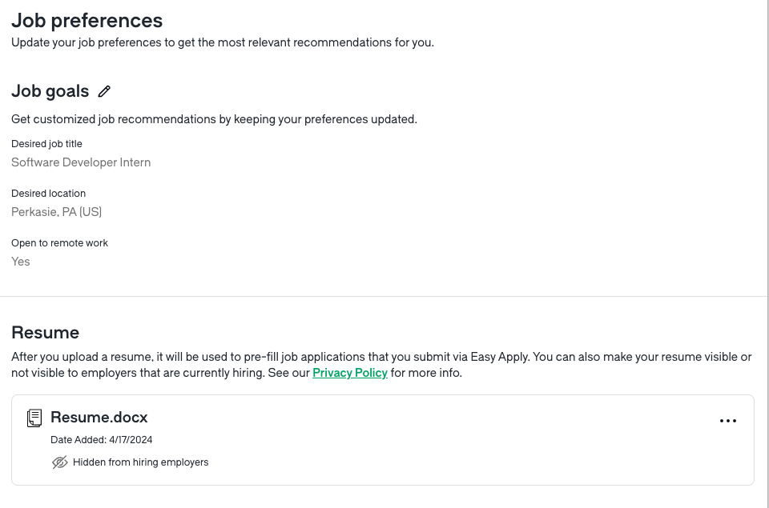
Updating job preferences was easy - just put in my location, desired job title, and whether or not I'm willing to work remotely, then upload my resume.

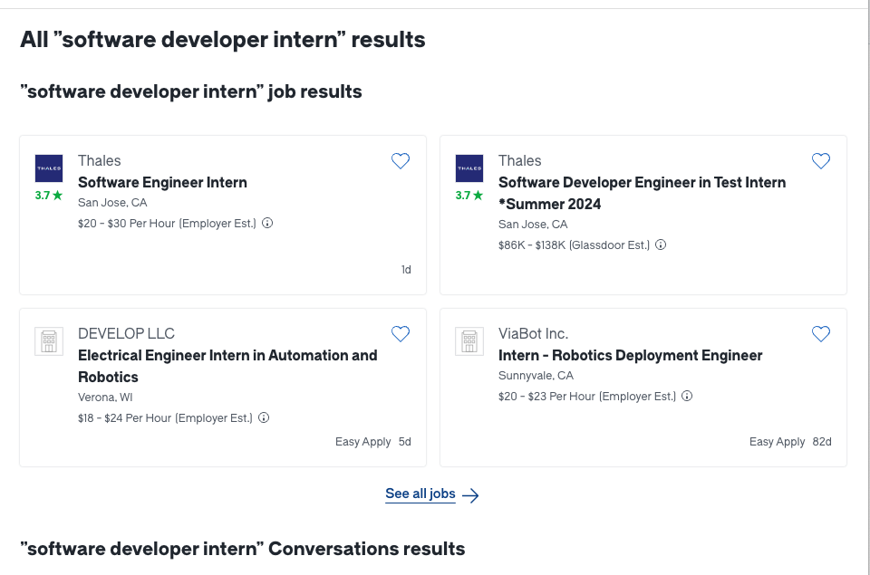
After searching for a job, they show you 4 jobs and 4 conversations, and you have to click "see all jobs" to filter anything. This is not ideal.

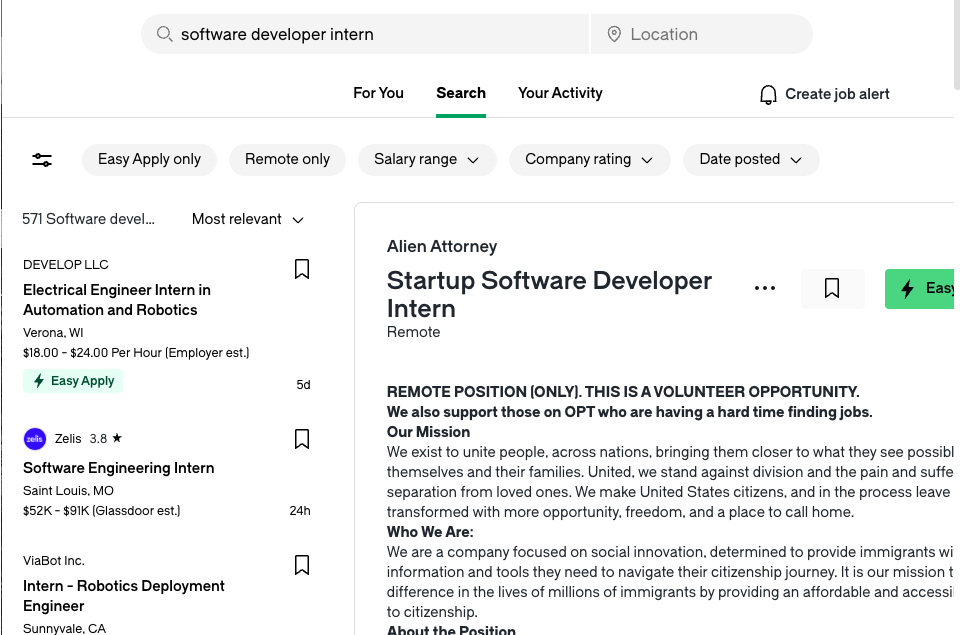
After you click "see all jobs" the interface looks promising. There are many filters to choose from and you get a more traditional sidebar with jobs and detailed overviews of each when you click on them.

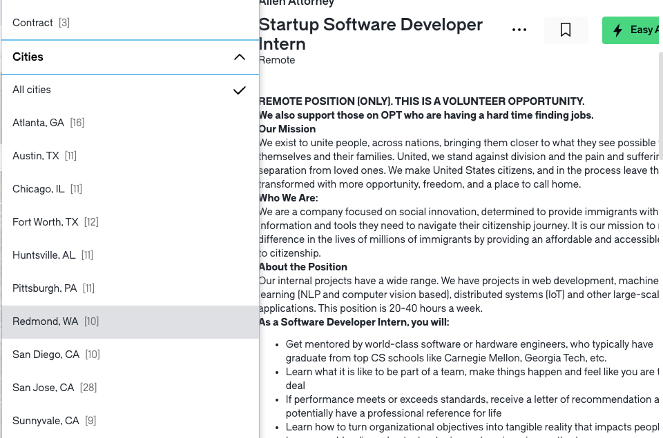
There is one glaring omission, however...you can only filter by one of a few cities, there is no granular location filter. This is a massive problem as many people are not able to relocate for work.

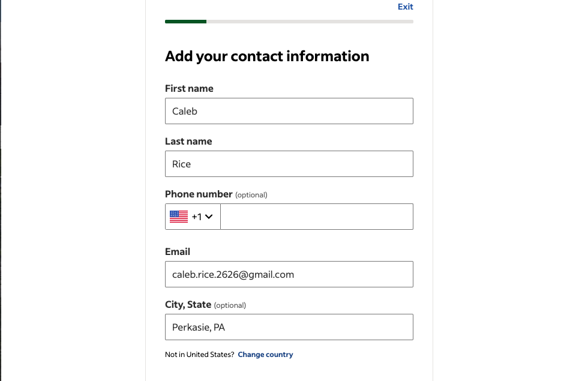
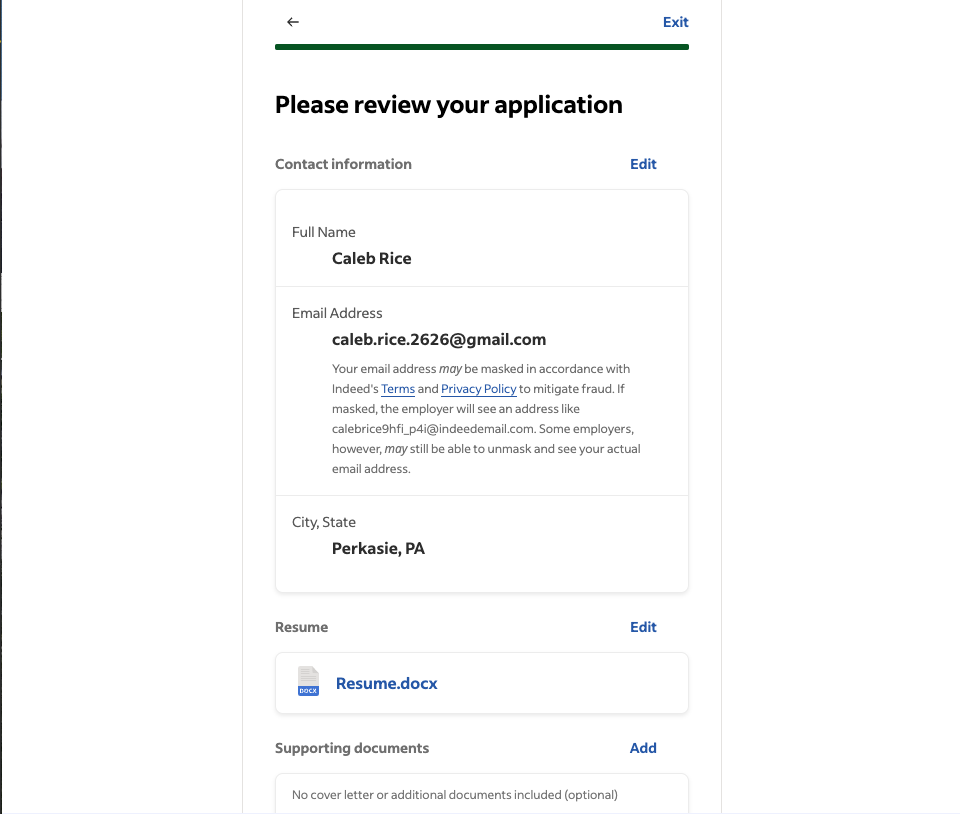
Applying is easy enough. You just click "Easy Apply", fill out your contact information and a few other things, and then send your application straight to the company.

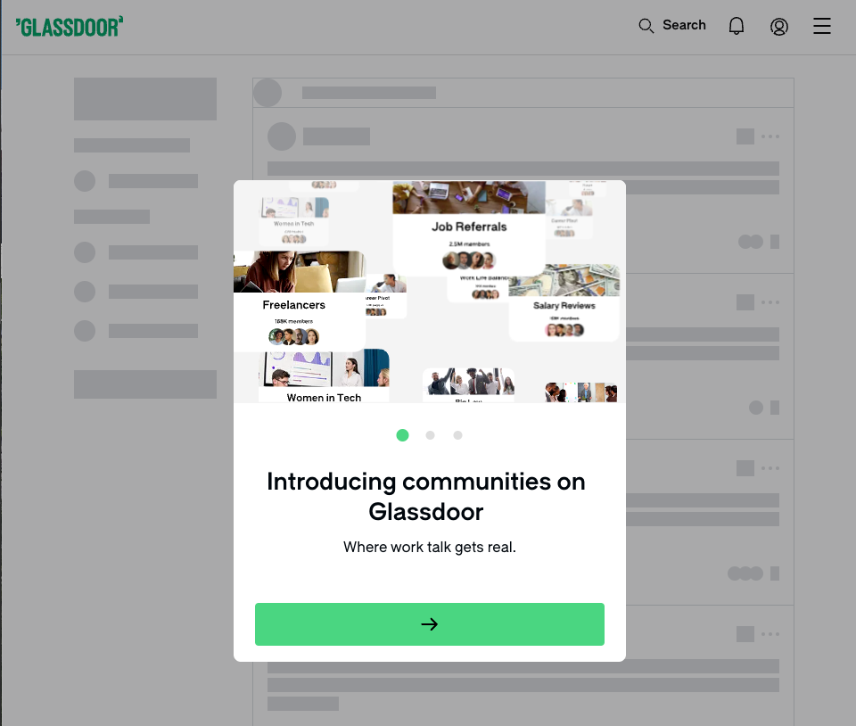
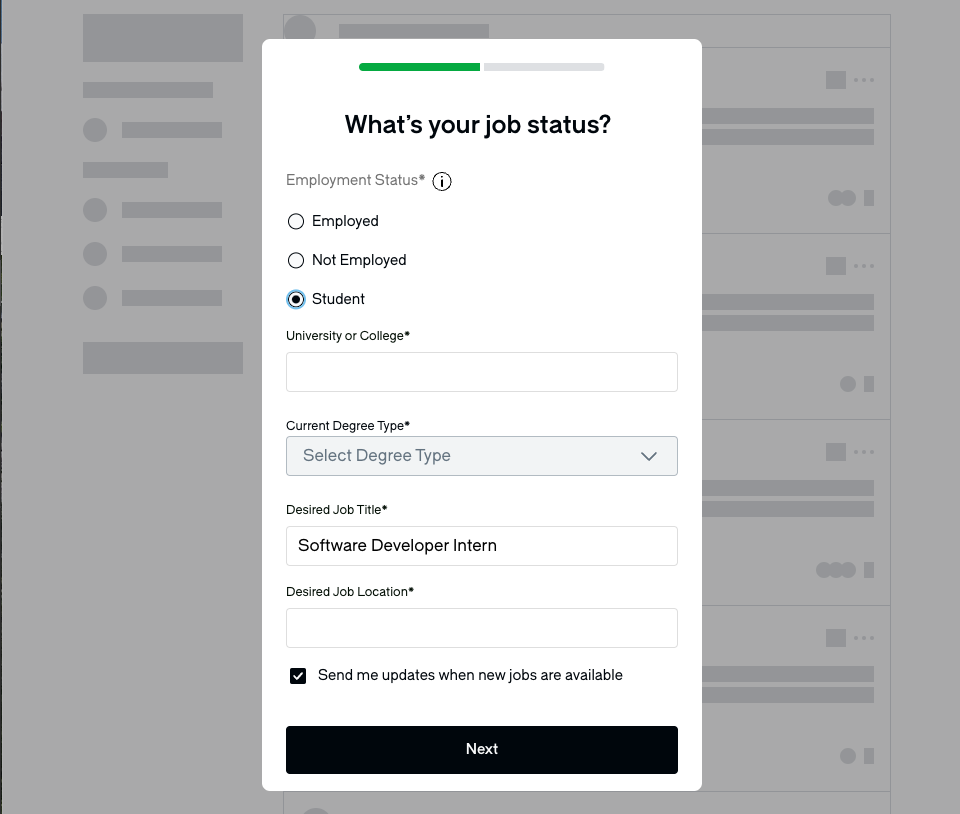
There is one other major problem...if you return to glassdoor.com by entering the URL after you have created an account, they give a popup saying you should take advantage of their "community" without telling you much about it and then require you to enter more personal information before allowing you to access anything on the site.

| Category                                                                                                    | Grade (0-3) | Comments / Justification                                                                                                                                                                                                                                                                                                                                                                                                                                                                                                                                       |
| ----------------------------------------------------------------------------------------------------------- | ----------- | -------------------------------------------------------------------------------------------------------------------------------------------------------------------------------------------------------------------------------------------------------------------------------------------------------------------------------------------------------------------------------------------------------------------------------------------------------------------------------------------------------------------------------------------------------------- |
| 1. **Don't make me think:** How intuitive was this site?                                                    | 3           | It was very easy to figure out how everything worked, there were no issues with confusion here.                                                                                                                                                                                                                                                                                                                                                                                                                                                                |
| 2. **Users are busy:** Did this site value your time?                                                       | 2           | There wasn't anything overly problematic, but they definitely did not go out of their way to show me around and how to do things quickly, and there were more clicks than necessary for some tasks.                                                                                                                                                                                                                                                                                                                                                            |
| 3. **Good billboard design:** Did this site make the important steps and information clear? How or how not? | 2           | The site makes almost no effort to show you around, so you're largely left to figure it out yourself. The interface is fairly easy to use, however, so it's not a huge problem.                                                                                                                                                                                                                                                                                                                                                                                |
| 4. **Tell me what to do:** Did this site lead you towards a specific, opinionated path?                     | 0           | It gave no advice on how best to use it.                                                                                                                                                                                                                                                                                                                                                                                                                                                                                                                       |
| 5. **Omit Words:** How careful was this site with its use of copy?                                          | 2           | There's not a lot of duplication, though the overview screen after you search but before you click "see all jobs" seems unnecessary.                                                                                                                                                                                                                                                                                                                                                                                                                           |
| 6. **Navigation:** How effective was the workflow / navigation of the site?                                 | 1           | Overall the site is actually laid out very well and is not hard to understand. However, the lack of a granular location filter makes it nearly impossible to actually find in-person jobs with unless you are willing to move anywhere, essentially rendering the site useless for many people. In addition, they force their idea of "community" onto visitors and if you return to the site after using it for the first tine they mandate entering more information to "join the community" before you can do anything else. This is another major turnoff. |
| 7. **Accessibility:** How accessible is this site to a screen reader or a mouse-less interface?             | 1           | It's technically useable without a mouse, but it doesn't work well and it's not always clear what element has focus.                                                                                                                                                                                                                                                                                                                                                                                                                                           |
| **TOTAL**                                                                                                   | 11          |                                                                                                                                                                                                                                                                                                                                                                                                                                                                                                                                                                |

## 2.3 Site 2 - ZipRecruiter
Insert Recorded Screenshots with captions and steps.

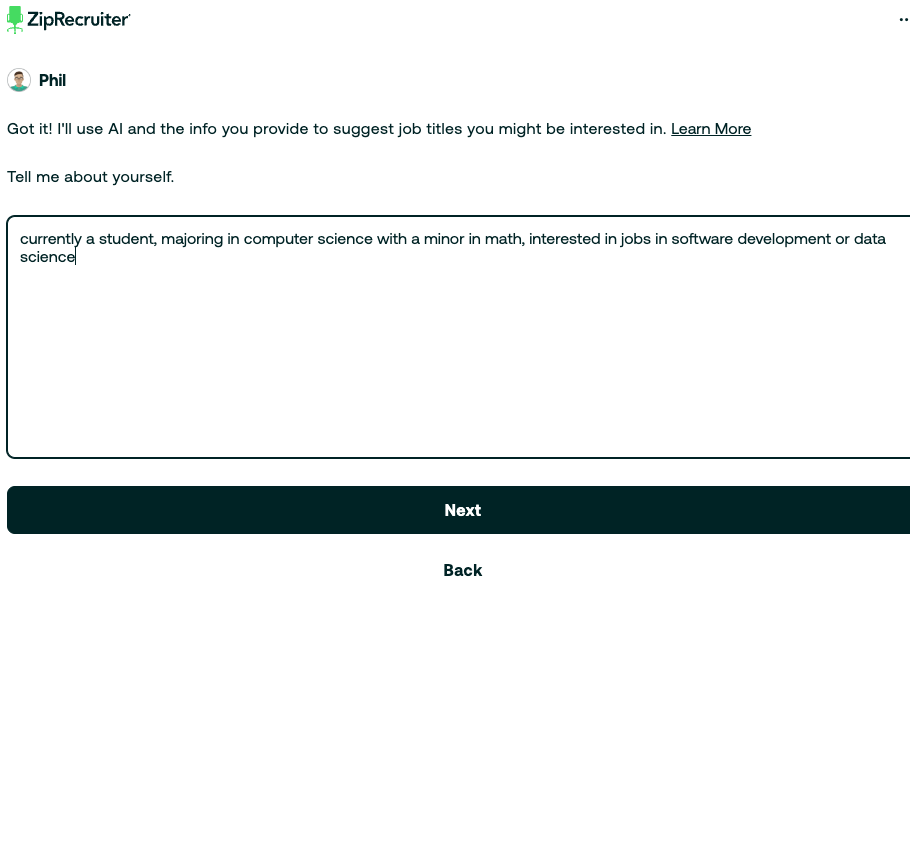
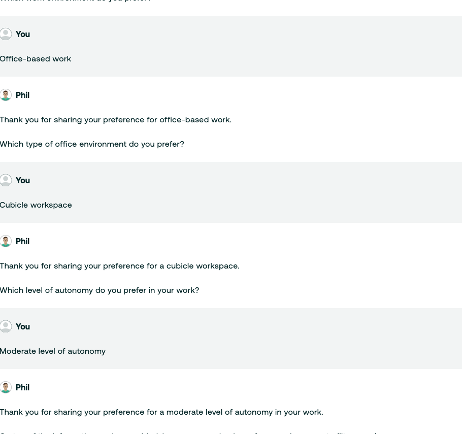
ZipRecruiter's sign-up process starts by using an AI chatbot to help you find the type of job you want (you can bypass this process if you so choose). Overall this works well and sets the profile up fairly well.

ZipRecruiter does ask for your phone number on a separate popup, which is mildly irritating, but it does give you the option to opt-out.
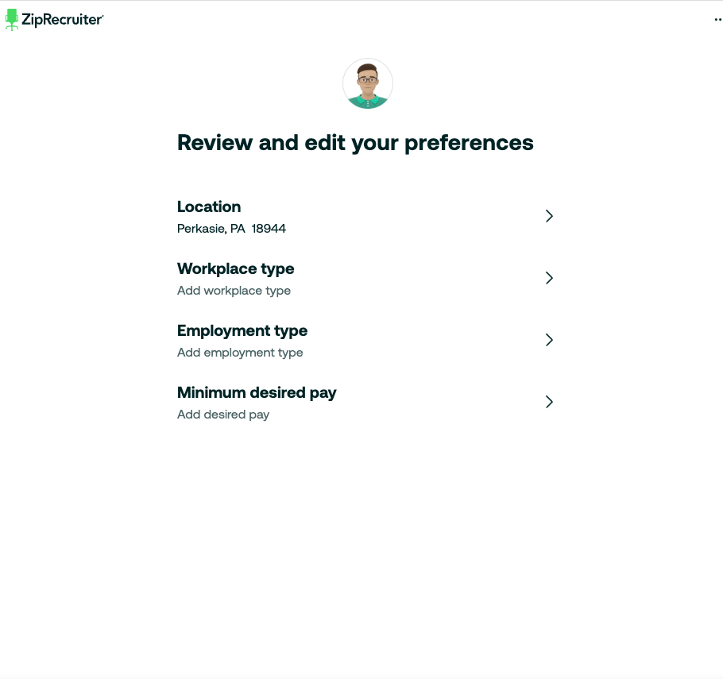
ZipRecruiter also allows you to quickly edit your job preferences as part of the sign-up process.
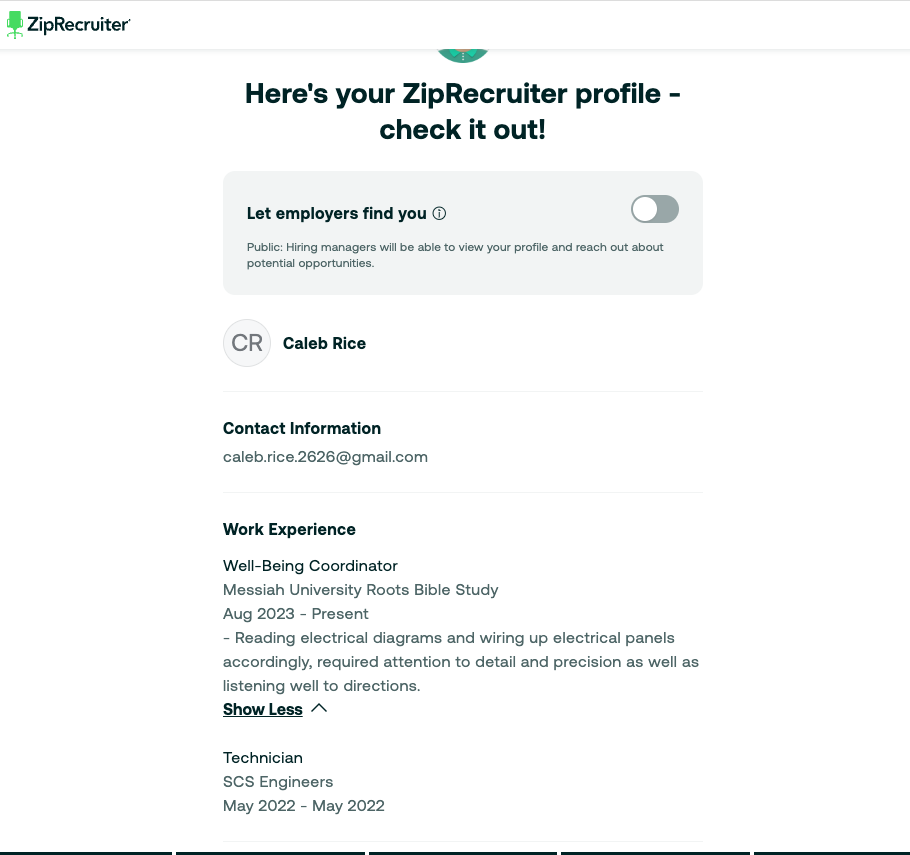
ZipRecruiter automatically generates a profile for you based on your resume. As expected with AI, it gets some things wrong, namely it misinterpreted my student leadership position as a job experience and put the description of my actual summer job from last year under that instead of under the actual job. Unfortunately, there is no way to edit the profile right from here.
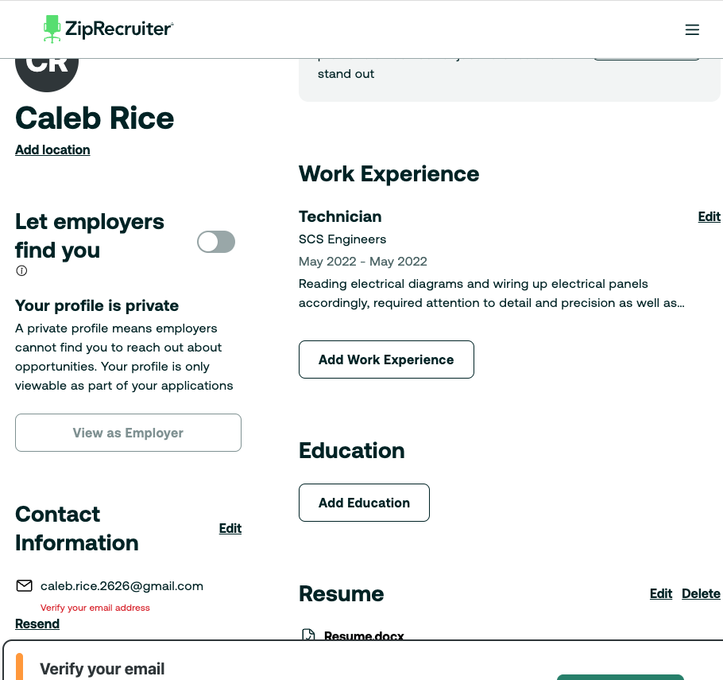
However, it is fairly easy to edit your profile after the signup process is complete. You just click on "edit" and make the changes you need to make.
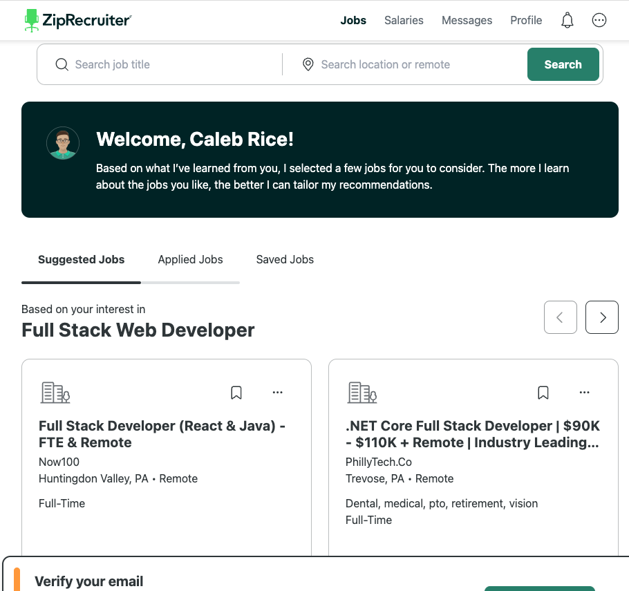
To get to ZipRecruiter's jobs page, simply click "jobs" in the navbar. Their initial page is helpful, with personalized recommendations based on preferences for job type, location, and office type.
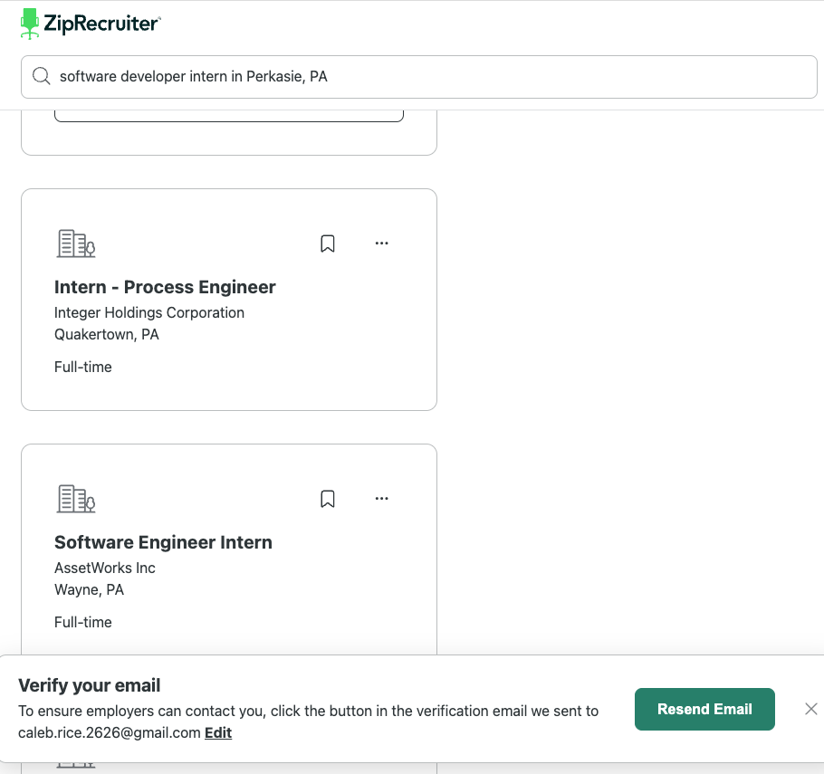
Applying for jobs is also straightforward. You just search for what you want, you get recommendations, you can filter by location, and then you click on a job that looks interesting and then click the apply button to go to the employer's website with the listing for the job.

| Category                                                                                                    | Grade (0-3) | Comments / Justification                                                                                                                                                                                                                                                                                                                                               |
| ----------------------------------------------------------------------------------------------------------- | ----------- | ---------------------------------------------------------------------------------------------------------------------------------------------------------------------------------------------------------------------------------------------------------------------------------------------------------------------------------------------------------------------- |
| 1. **Don't make me think:** How intuitive was this site?                                                    | 2           | This site was very functional, though a few things that should work didn't, including editing the AI-generated profile during sign-up as well as searching without specifying a location, and it wasn't always responsive on the first click.                                                                                                                          |
| 2. **Users are busy:** Did this site value your time?                                                       | 2           | The site takes more time to use than others as the sign-up process is quite comprehensive and requires navigating through several screens. The process is automated and helpful, however, and once you are signed in, everything is easily accessible.                                                                                                                 |
| 3. **Good billboard design:** Did this site make the important steps and information clear? How or how not? | 3           | The important information is front and center on every page and the interface is very clean.                                                                                                                                                                                                                                                                           |
| 4. **Tell me what to do:** Did this site lead you towards a specific, opinionated path?                     | 2           | The site very much walks you through setting up your profile and continues to provide suggestions as you use it. It doesn't provide much of a tutorial on how to use the actual job search engine. With the exception of not being able to search without specifying a location that is in their system, it's fairly intuitive to use, so it's not strictly necessary. |
| 5. **Omit Words:** How careful was this site with its use of copy?                                          | 3           | The site is very clean and I never felt like I was repeating steps.                                                                                                                                                                                                                                                                                                    |
| 6. **Navigation:** How effective was the workflow / navigation of the site?                                 | 2           | The site navigation is intuitive and works well. There's a top navigation bar with the important pages and everything is easily visible. There are a few quirks including the aforementioned searching without location issue.                                                                                                                                         |
| 7. **Accessibility:** How accessible is this site to a screen reader or a mouse-less interface?             | 1           | It works without a mouse to a point, but be prepared to make excessive use of the "tab" key, and there are a few things that cannot be selected. At least it's clear which element has focus.                                                                                                                                                                          |
| **TOTAL**                                                                                                   | 15          |                                                                                                                                                                                                                                                                                                                                                                        |

# Step 3 Competitive Usability Test

## Step 3.1 Product Use Case

| Use Case #1         |                                                                                                                                   |
| ------------------- | --------------------------------------------------------------------------------------------------------------------------------- |
| Title               | Make an account                                                                                                                   |
| Description / Steps | Click "sign up", enter email and password, confirm, confirm email address, upload a resume and anything else the website asks for |
| Primary Actor       | The user who is looking for jobs                                                                                                  |
| Preconditions       | The user needs to be on the website                                                                                               |
| Postconditions      | The user has an account with skills listed and can start searching for jobs                                                       |

## Step 3.2 Identifier a competitive product

List of Competitors
1. Competitor 1 [www.awesomesauce.com](www.awesomesauce.com)
2. Competitor 2 [Bangarang Peter](https://www.youtube.com/watch?v=4PNOccSUb1Q)

## Step 3.3 Write a Useability Test

| Step | Tasks | Notes |
| ---- | ----- | ----- |
| 1    |       |       |
| 2    |       |       |
| 3    |       |       |
| ...  |       |       |
| n    |       |       |

## Step 3.4 Observe User Interactions

| Step | Tasks | Observations |
| ---- | ----- | ------------ |
| 1    |       |              |
| 2    |       |              |
| 3    |       |              |
| ...  |       |              |
| n    |       |              |

## Step 3.5 Findings
Organize your findings here.