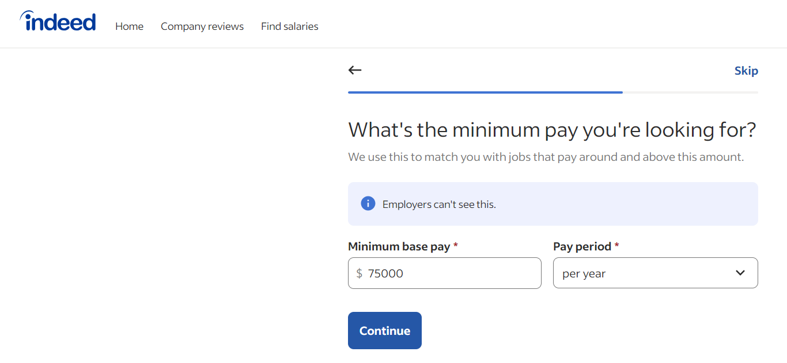
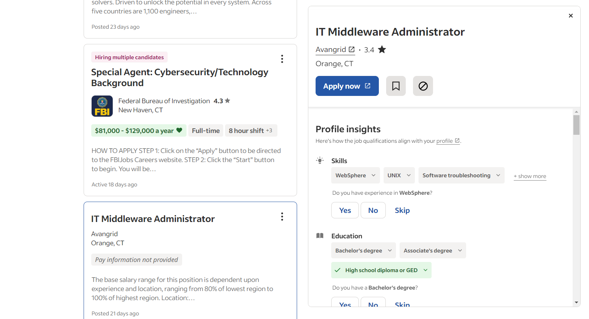

# Lab Report: UX/UI
___
**Course:** CIS 411, Spring 2024  
**Instructor(s):** [Devi Bhakta Suberi](https://github.com/dsuberi)  
**Name:** Ethan Santoro
**GitHub Handle:** ethan-santoro
**Repository:** https://github.com/ethan-santoro/cis411_lab3_uiux.git
**Collaborators:**   
___

# Step 1: Confirm Lab Setup
- [x] I have forked the repository and created my lab report
- [ ] If I'm collaborating on this project, I have included their handles on the report and confirm that my report is informed, but not copied from my collaborators.

# Step 2: Evaluate Online Job Search Sites

## 2.1 Summary
| Site | Score | Summary |
|---|---|---|
| indeed.com | 3/3 | An extremely simple yet effective website. Demonstrates a clean interface and intuitive navigation. |
| ziprecruiter.com | 1/3 | Another simple website, but with a major flaw. The use of AI is subpar, and becomes a hindrance to the site rather than a compliment. |

## 2.2 Site 1
**Website:** indeed.com

Creating an account on Indeed with my contact information and resume.\

Applying for a cloud engineering position (screenshot zoomed out to fit).\

Attaching my resume to the application.\

Reviewing and submitting the application.\

| Category | Grade (0-3) | Comments / Justification |
|---|---|---|
| 1. **Don't make me think:** How intuitive was this site? | 3 | Indeed is simple and easy to navigate, even for new users. Large, colored buttons painted against a clean white backdrop make the interface clear and readable. |
| 2. **Users are busy:** Did this site value your time?  | 3 | As a byproduct of being so simple and straightforward, this site definitely values the user's time. When "submitting" my job application, I was able to fill in each required category seamlessly. The entire process only took a few minutes to complete. |
| 3. **Good billboard design:** Did this site make the important steps and information clear? How or how not? | 3 | As previously mentioned, Indeed highlights each important step through the use of color. From the attached screenshots, you can see that accentual colors are reserved for buttons that carry significance, such as "apply" or "submit application." |
| 4. **Tell me what to do:** Did this site lead you towards a specific, opinionated path? | 3 | This pairs with the "don't make me think" category. In being so straightforward, this website simultaneously appeared to be guiding the user forward, always showing the way forward to the next destination. |
| 5. **Omit Words:** How careful was this site with its use of copy? | 3 | There were no repeated words or phrases except when absolutely necessary.  |
| 6. **Navigation:** How effective was the workflow / navigation of the site? | 3 | Again, the user interface was clean and polished. This allowed for smooth and intuitive navigation. |
| 7. **Accessibility:** How accessible is this site to a screen reader or a mouse-less interface? | 3 | Indeed is highly accessible for screen readers, and still works well even without a mouse. My laptop can fold over into a tablet, and I was able to complete the entire job application process again while only using a touch screen. |
| **TOTAL** | 3 | Indeed recieved  3/3 ratings across the board due to its cleanliness, accessibility, and clean interface. This is the type of website that I love to see; everything is intuitive and there are no confusing attributes to be found. |

## 2.3 Site 2
**Website:** ziprecruiter.com

After clicking on the option to "sign up," I was brought to this page:\

ZipRecruiter uses AI in order to gain an understanding of what the user may be interested in.\

The website continues to provide follow-up questions to hone in on the user's interests.\

| Category | Grade (0-3) | Comments / Justification |
|---|---|---|
| 1. **Don't make me think:** How intuitive was this site? | 2 | ZipRecruiter is relatively intuitive to use, being mostly straightforward. I deducted a point from this category simply because the "sign up" button wasn't present; users must first navigate to the "sign in" page and then select the option to create an account from there. |
| 2. **Users are busy:** Did this site value your time?  | 0 | This was my most substancial complaint with the website. From the screenshots above, you'll notice that ZipRecruiter's AI continued to ask follow-up questions in order to find a specific field of interest. However, this process became annoying and repetitive after the third question. In fact, I stopped attaching screenshots because the site continued to ask so many questions that I eventually gave up on creating an account in the first place. |
| 3. **Good billboard design:** Did this site make the important steps and information clear? How or how not? | 1 | The user may be able to gauge that the AI's questions are relevant to a job search, but it's unclear how many total queries there are before recommended jobs will appear. The significance of these selections was also questionable, since a simple resume upload would have voided the need to answer any of them. |
| 4. **Tell me what to do:** Did this site lead you towards a specific, opinionated path? | 3 | The site certainly sent me down a clear path... although this path wasn't entirely purposeful. I wish that there had been a progress bar (or something similar) to indicate how close the user's profile is to completion. |
| 5. **Omit Words:** How careful was this site with its use of copy? | 1 | I'll give Ziprecruiter a point here for effort, but I immediately noticed that their AI repeated itself in almost the same manner after every question. You can observe this in the final screenshot for this section, where the phrase "that's great to hear that you..." was used over and over again. |
| 6. **Navigation:** How effective was the workflow / navigation of the site? | 2 | Once again, this category is similar to "don't make me think." Although the site was easy to navigate, I wish that buttons had been more prominently displayed (instead of being jammed into the corner of the screen, for example). |
| 7. **Accessibility:** How accessible is this site to a screen reader or a mouse-less interface? | 2 | The website is relatively accessible for screen readers, and a mouse-less interface works in the same manner that a regular desktop would normally. Once again, I tested this by turning my laptop into tablet mode, and was able to accomplish the same tasks by using a touch screen. |
| **TOTAL** | 1 | I'm giving ZipRecruiter an average score of 1/3, simply because of how frustrating it is to use. ALthough I appreciared the incorperation of AI, I still wished that there had been a simple button to upload a resume. This would save the user quite a bit of time, and would solve the pointless interrogation. |

# Step 3 Competitive Usability Test

## Step 3.1 Product Use Case

| Use Case #1 | |
|---|---|
| Title | Interaction with Interface |
| Description / Steps | This Use Case demonstrates the different functions that the user can perform when interacting with the system. [UC:01] The user may type a prompt into the "chat" box. [UC:02] The user may upload their own API for a custom AI. [UC:03] The user may filter results based on the different responses from the AIs. [UC:04] The user may add additional AIs to their interface. [UC:05] The user may remove an AI from the interface. |
| Primary Actor | User |
| Preconditions | Assume that the user has logged into the application. |
| Postconditions | The user may view all of the different outputs from each AI simultaneously. |

## Step 3.2 Identify a competitive product

| Number | Name | Link |
|---|---|---|
| Competitor 1 | ChatGPT | https://chat.openai.com/ |
| Competitor 2 | ChatGot | https://www.chatgot.io/ |
| Competitor 3 | Copilot | https://copilot.microsoft.com/ |
| Competitor 4 | Gemini | https://gemini.google.com/app |

## Step 3.3 Write a Useability Test

| Step | Tasks | Notes |
|---|---|---|
| 1 | Define objectives | Creating objectives for the test is necessary in order to define what needs to be accomplished.  |
| 2 | Select users | Users must not have been exposed to the software prior to testing. |
| 3 | Create the test scenario | The test must be prepared in advance in order to evaluate its strengths and weaknesses. |
| 4 | Conduct the test  | Self-explanatory; allow users to interact with the software. |
| 5 | Organize feedback | Gather feedback from the users. Was the software easy to use? Was it intuitive? Was it time consuming? |
| 5 | Report findings | Document all feedback for evaluation; check to see if any common issues occurred. |
| 6 | Improve software | Make the necessary changes based on user feedback. |

## Step 3.4 Observe User Interactions

| Step | Tasks | Observations |
|---|---|---|
| 1. Log in to the application. | The participant was able to successfully log in to the application. | The log in button should be moved from a bar in the top right corner to a separate page. The button should be obvious, and placed in the middle of the screen. |
| 2. Enter a prompt/ask a question. | The participant entered a question into the avaliable text box.  | No hindrences here; the user interface was reported to be intuitive. |
| 3. Add/remove an AI output window. | The participant removed one AI window from the interface in order to narrow down the outputs. | The color display for each window surrounding an AI output should be a little brighter. |
| 4. Log out of the application. | The participant successfully logged out of the application. | No issues here; the logout process was straightforward.  |

## Step 3.5 Findings

**Improvements:** 