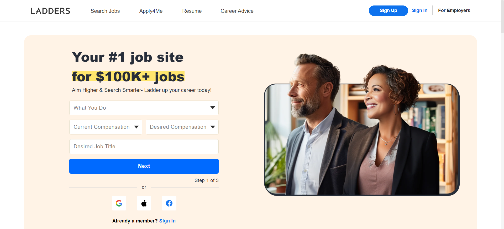

# Lab Report: UX/UI
___
**Course:** CIS 411, Spring 2024  
**Instructor(s):** [Devi Bhakta Suberi](https://github.com/dsuberi)  
**Name:** Jacob Hamm  
**GitHub Handle:** Your GitHub Handle  
**Repository:** Your Forked Repository  
**Collaborators:**   
___

# Step 1: Confirm Lab Setup
- [X] I have forked the repository and created my lab report
- [X] If I'm collaborating on this project, I have included their handles on the report and confirm that my report is informed, but not copied from my collaborators.

# Step 2: Evaluate Online Job Search Sites

## 2.1 Summary
| Site | Score | Summary |
|---|---|---|
|Indeed|10/10|Known website with high volume of users|
|iHire|5/10|Uncommon webstie looks decent but not as easy as indeed|

## 2.2 Site 1
    

| Category | Grade (0-3) | Comments / Justification |
|---|---|---|
| 1. **Don't make me think:** How intuitive was this site? |3|Good, not hard to understand at all.|
| 2. **Users are busy:** Did this site value your time?  |3|Yes, on the homepage it already has job offerings, just insert your preferences and location and you are already looking|
| 3. **Good billboard design:** Did this site make the important steps and information clear? How or how not? |3|Yes, like said above, the hompeage immediately lets the user put in preferences and then you click search and are looking at jobs that fit description|
| 4. **Tell me what to do:** Did this site lead you towards a specific, opinionated path? |3|Yes, you insert preferences into the left side of the search bar and |
| 5. **Omit Words:** How careful was this site with its use of copy? |2|Alot of these sites all seem the same but it looks good and has its own functions and things to it.|
| 6. **Navigation:** How effective was the workflow / navigation of the site? |3|Homepage is really the only page you need if you are signed in, but finding the account settings to sign in and everything is easy|
| 7. **Accessibility:** How accessible is this site to a screen reader or a mouse-less interface? |3|Accessible|
| **TOTAL** |21|

## 2.3 Site 2
  

| Category | Grade (0-3) | Comments / Justification |
|---|---|---|
| 1. **Don't make me think:** How intuitive was this site? |2|Got much more directions and functions to find things so its not simple.|
| 2. **Users are busy:** Did this site value your time?  |2|More simplicity allows for less time wasted.|
| 3. **Good billboard design:** Did this site make the important steps and information clear? How or how not? |2|It had popups when signing up and looking at windows for the first time but can still be confusing.|
| 4. **Tell me what to do:** Did this site lead you towards a specific, opinionated path? |3|Process that made you fill in information|
| 5. **Omit Words:** How careful was this site with its use of copy? |3|Don't think I've seen other job searching sites look like this one|
| 6. **Navigation:** How effective was the workflow / navigation of the site? |3|Navigation was more complex than indeed but it had more functionality to it so it was reasonable.|
| 7. **Accessibility:** How accessible is this site to a screen reader or a mouse-less interface? |3|Accessible|
| **TOTAL** |18|

# Step 3 Competitive Usability Test

## Step 3.1 Product Use Case

| Use Case #1 | |
|---|---|
| Title | Unified Class Registration |
| Description / Steps | Simplified class that combines all original websites into one |
| Primary Actor | Faculty/Student |
| Preconditions | User logs into application |
| Postconditions | User finishes deciding schedule |

## Step 3.2 Identifier a competitive product

The View
DegreeWorks

## Step 3.3 Write a Useability Test

| Step | Tasks | Notes |
|---|---|---|
| 1 |Log in to registration application|Uses messiah credentails|
| 2 |Browse available courses|Uses combined websites to give user information|
| 3 |Add courses to schedule|Create function allowing a schedule to be made|
| 4 |Finalize schedule|Register for the classes|

## Step 3.4 Observe User Interactions

| Step | Tasks | Observations |
|---|---|---|
| 1 |Log in to the registration system|User easily locates the login button and inserts login information|
| 2 |Browse available courses|User filters classes and searches the classes he/she wants to find|
| 3 |Add courses to schedule|User creates schedule which will visually show times and classes |
| 4 |Finalize registration|Make sure classes all fit together time wise and are necessary for graduation|

## Step 3.5 Findings

### Improvements: ###
- Simplify password recovery process to reduce user frustration during login.
- Enhance course search filters to allow for easier browsing based on time, professor, or availability.
- Clarify the course scheduling interface to improve user understanding and efficiency.
### Positive Experiences: ###
The search feature was intuitive and helped users quickly find relevant courses.
The registration process overall was straightforward once users navigated through initial hurdles.
### What Went Well: ###
- The usability test effectively identified areas for improvement in the registration system.
- Users were able to provide valuable feedback on their experiences and pain points.
### Areas for Improvement: ###
- Providing clearer instructions and guidance for users, especially during complex tasks like course scheduling.
- Ensuring consistency and clarity throughout the registration process to minimize confusion.
### Experience Statement: ###
Conducting the usability test provided valuable insights into the strengths and weaknesses of the college's registration system. By observing user interactions and gathering feedback, we gained a better understanding of how to improve the system to enhance the user experience for students registering for classes.
